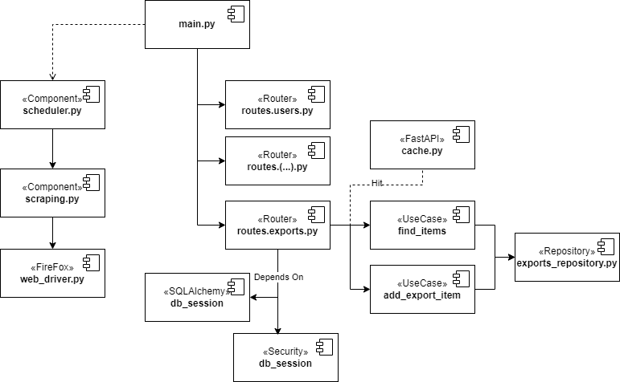
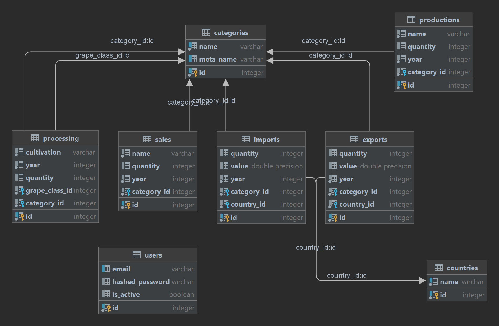

# vvc API

## Main Components

* Python 12.x
* [FastApi 0.111.x](https://fastapi.tiangolo.com/tutorial/)
* [AIOCache 0.12.2](https://pypi.org/project/aiocache/)
* [SQLAlchemy 2.x](https://docs.sqlalchemy.org/en/20/contents.html)

## Configuring Environment

1. Install [Python 3.12](https://www.python.org/downloads/)
2. Create a virtual env and install dependencies
```bash
vvc-api$ python3.12 -m venv ./env
vvc-api$ source env/bin/activate
(env) vvc-api$ pip install -r requirements.txt
```
3. Inspect/Edit with your preferred IDE
4. Run or Build a docker image
```bash
(env) vvc-api$ fastapi dev main.py --port 8000
```
```bash
(env) vvc-api$ docker build -t vvc-api .
(env) vvc-api$ docker run [-d] -p 8000:8000 vvc-api:latest
```
5. Optionally, run tests from `test_main.http`

## Project Structure

### VVC-API Components



### VVC-API Schema


### VVC-API Domain Mapping

#### Production Domain
* **Embrapa Domain**: Produção
* **Data Categories**: N/A (Single CSV file)
* **Database Table**: productions
* The _Produção.csv_ file encompasses all production data without further categorization.


#### Processing Domain

**Embrapa Domain**: Processamento
* **Data Categories**: Viníferas, Americanas e híbridas, Uvas de mesa, Sem classificação
* **Database Table**: processing
* Has multiple CSV files (_ProcessaViniferas.csv, ProcessaAmericanas.csv, ProcessaMesa.csv, ProcessaSemclass.csv_) describing its categories.

#### Commercialization Domain

* **Embrapa Domain**: Comercialização
* **Data Categories**: N/A (Single CSV file)
* **Database Table**: sales
* The Comercio.csv file contains all commercialization data and will be mapped to the **sales** table.

#### Imports Domain

* **Embrapa Domain**: Importação
* **Data Categories**: Vinhos de mesa, Espumantes, Uvas frescas, Uvas passas, Suco de uva
* **Database Table**: imports
* The import data is categorized into multiple CSV files (ImpVinhos.csv, ImpEspumantes.csv, ImpFrescas.csv, ImpPassas.csv, ImpSuco.csv). 

#### Exports Domain

* **Embrapa Domain**: Exportação
* **Data Categories**: Vinhos de mesa, Espumantes, Uvas frescas, Suco de uva
* **Database Table**: exports
* Similar to the imports domain, exports data is categorized into multiple CSV files (with similar naming conventions also).


### Project Internal Structure

```
├── appscheduler
├── Dockerfile
├── dtos
├── infra
    ├── cache
    ├── converter
    ├── database
    └── security
├── main.py
├── models
├── repositories
    ├── category_repository.py
    ├── exports_repository.py
    └── ... 
├── requirements.txt
├── routes
├── scraping
└── ucs
    ├── categories
    ├── imports
    └── token
    └── ...
```

* **appscheduler** - Scheduler logic & job setup to map and scrape [Embrapa](http://vitibrasil.cnpuv.embrapa.br/index.php?opcao=opt_01) csv datasets
* **Dockerfile** - Minimal configuration to build an image
* **infra** - Database, repositories and other infra-related scripts
* **models** - Core models of this API
* **requirements.txt** - Project dependencies - install them before running the project
* **routes** - FastAPI routes definition scripts
* **scraping** - Selenium/FF based scraping component 
* **ucs** - API use cases 

### API Docs

[Available here](http://localhost:8000/docs) or _http://hostname/docs_